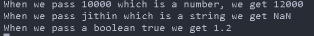

# Static Types

This section explores TypeScript's type system, contrasting it with JavaScript's. We'll delve into type inference capabilities of the TypeScript compiler and showcase features for precise data type control. These features range from guiding the compiler on expected code behavior to configuration adjustments.

### The problem:

```
let myData;
console.log(`${myData} is of type ${typeof myData}`);
myData = 12;
console.log(`${myData} is of type ${typeof myData}`);
myData = "Jithin";
console.log(`${myData} is of type ${typeof myData}`);
myData = true;
console.log(`${myData} is of type ${typeof myData}`);
myData = null;
console.log(`${myData} is of type ${typeof myData}`);

```


The above code shows us the dynamic nature of JavaScript. Even though this allow our code to be flexible, it cause problems as shown below 👇

```
const calculateTax = (amount) => {
  return amount * 1.2;
};
console.log(
  `When we pass 10000 which is a number, we get ${calculateTax(10000)}`
);
console.log(
  `When we pass jithin which is a string we get ${calculateTax("jithin")}`
);
// Here the boolean true is coerced to 1 by javascript
console.log(`When we pass a boolean true we get ${calculateTax(true)}`);

```



This code will get executed without any error in javascript.
Passing a string as argument cause the returned value a NaN and passing a boolean cause the returned value as 1 due to type coersion by javascript.

**_Inorder to solve the about problem TypeScipt have static type feature makes type
assumptions explicit and allows the compiler to report an error when different data
types are used._**

## Type Annotation

In TypeScript we uses **type annotation** for static typing as shown below:

```
// Now we can have the TS version of the above calculate tax function.
const calculateTax = (amount: number): number => {
  return amount * 1.2;
};
console.log(
  `When we pass 10000 which is a number, we get ${calculateTax(10000)}`
);

```


```
console.log(`When we pass jithin which is a string we get ${calculateTax("jithin")}`
);
console.log(`When we pass a boolean true we get ${calculateTax(true)}`);

```

**This above log cause compiler error.❌**


**Applying type annotation on variables and constants.**

```
let price: number = 20000;
let user: string = "jithin";

let taxAmount: number = calculateTaxTS(price);
let halfShare: number = taxAmount / 2;

console.log("TaxAmount is:", taxAmount);
console.log("Half Share is:", halfShare);
```

## Type Inference

A feature of the typescript compiler is that it can infer types (implicitly do type declaration for us).

if we define :

```
let price = 100;

```

Typescript compiler will automatically infer number type for price.

The compiler is also able to infer the result of the calculateTax function because
it knows that only number parameters will be accepted, that 1.2 is a number value, and
that the result of the multiplication operator on two number values is a number.

The result from the function is assigned to the taxAmount variable, which the compiler is also able to infer as a number. Finally, the compiler knows the type produced by the division operator on two number values and can infer the type of the halfShare variable, too.

**_Now you will have a doubt What will happen if the type inferencing doesn't match. We will see about that below.👇_**

```

const calculateTax = (amount: number) => {
  return (amount * 1.2).toFixed(2);
};

let price = 100;
let taxAmount = calculateTax(price);
let halfShare = taxAmount / 2;
console.log(`Full amount in tax: ${taxAmount}`);
console.log(`Half share: ${halfShare}`);

```

Here the price is infer to number by the compiler. But in the calculateTax, the function returns a string, as the toFixed() method convert the number to string. So the taxAmount variable get infered as a string.

Now a division between two types happen (taxAmount / 2). ([taAamount-string][2-number])

**What happen if this is in JS?**
-The operation returns a number if the taxAmountTS can be typecoersed to a number else it return NaN.

But in **TS automatic type coersion is restricted** so this gives error❌.


## 'any' type

While preserving JavaScript's flexibility, TypeScript offers the any type for scenarios where stricter type checking is undesirable, allowing any data type to be assigned to variables, function parameters, or return values.

we can refactor the about example with any:

```
const calculateTax = (amount: any): any => {
return (amount \* 1.2).toFixed(2);
}
```

These annotations tell the compiler that the amount parameter can accept any value
and that the function’s result may be of any type. The use of the any type stops the
compiler from reporting the error produced. **We are responsible for ensuring that your code doesn’t
misuse types.**

### Implicit any

The TypeScript compiler will use any when it is assigning types implicitly and cannot
identify a more specific type to use.
It is good practice to disable the implicit use of any by setting the compiler’s
noImplicityAny setting:

```
{
 "compilerOptions": {
 "target": "ES2022",
 "outDir": "./dist",
 "rootDir": "./src",
 "declaration": true,
 "noImplicitAny": true
 }
}

```

**The compiler will display this warning when it cannot infer a more specific type,
although this doesn’t prevent the explicit use of any.** 👈🏼

## Type union

TypeScript offers a spectrum of type safety. any allows any data type, providing maximum flexibility. On the other hand, type annotations for a single type strictly limit values. Finding a middle ground are type unions, which **define a set of allowed types**.


```
function calculateTax(amount: number, format: boolean): string | number {
 const calcAmount = amount * 1.2;
 return format ? `$${calcAmount.toFixed(2)}` : calcAmount;
}
let taxNumber = calculateTax(100, false);
let taxString = calculateTax(100, true);

```

The type returned by the calculateTax function is the union of the string and number types. It doesn't have a single, clear output type. Instead, it can return either a string or a number. The function can only use features that both strings and numbers have in common (intersection), which in most cases is very limited.

You can see in below image that only toString() is common to both. So string | number type will get only this method to use.


Look at the below code to get more clarity !!

```
let taxNumber: string | number = calculateTax(100, false);
let taxString: string | number = calculateTax(100, true);
console.log(`Number Value: ${taxNumber.toFixed(2)}`);
console.log(`String Value: ${taxString.charAt(0)}`);

```

The about code on calculateTax function cause error ❌


## Type assertion

In TypeScript, a type assertion instructs the compiler to treat a value as a specific type. This is useful for type narrowing, which means converting a broader type (like a union) to a more specific one. To perform a type assertion, you use the as keyword followed by the desired target type.


```
function calculateTax(amount: number, format: boolean): string | number {
  const calcAmount = amount * 1.2;
  return format ? `$${calcAmount.toFixed(2)}` : calcAmount;
}

let taxNumber = calculateTax(100, false) as number;
let taxString = calculateTax(100, true) as string;

console.log(`Number Value: ${taxNumber.toFixed(2)}`);
console.log(`String Value: ${taxString.charAt(0)}`);

```

The output of above code expression narrows down taxNumber to a number type and taxString to string type so that we can perform type specific methods on them.


**_No type conversion is performed by a type assertion, which only tells
the compiler what type it should apply to a value for type checking._**

### Asserting to an unexpected type

```
function calculateTax(amount: number, format: boolean): string | number {
  const calcAmount = amount * 1.2;
  return format ? `$${calcAmount.toFixed(2)}` : calcAmount;
}
let taxNumber = calculateTax(100, false) as number;
let taxString = calculateTax(100, true) as string;
let taxBoolean = calculateTax(100, false) as boolean;

console.log(`Number Value: ${taxNumber.toFixed(2)}`);
console.log(`String Value: ${taxString.charAt(0)}`);
console.log(`Boolean Value: ${taxBoolean}`);

```

In the above code we are type asserting to a non-sepecified type of boolean. This code cause error.❌


