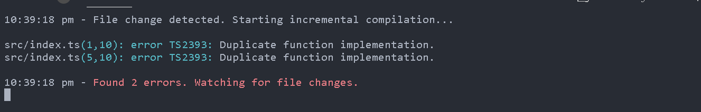
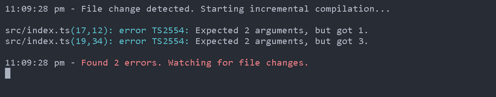
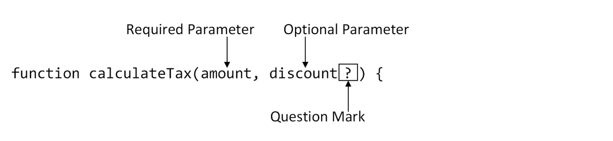
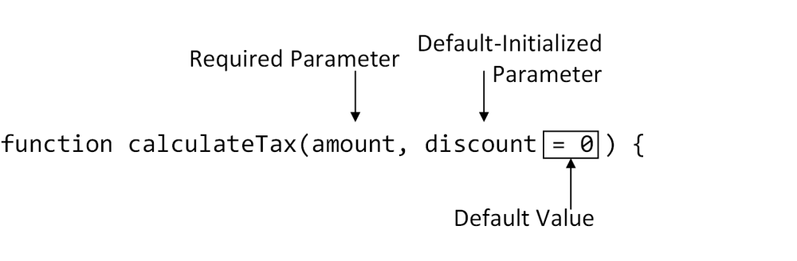

# Using Functions

## Redefining functions

In JS, a function can bedefined more than once, and the most recent implementation is used when the function is invoked. Typescipt compiler reports an error when more than one function is defined at the same time.



## Understanding function parameters

Typescript has a stricter approach than javascript and expects functions to be used with the same number of arguments as there are parameters.

```
function calculateTax(amount, discount) {
 return (amount * 1.2) - discount;
}
let taxValue = calculateTax(100, 0);
console.log(`2 args: ${taxValue}`);
taxValue = calculateTax(100);
console.log(`1 arg: ${taxValue}`);
taxValue = calculateTax(100, 10, 20);
console.log(`3 args: ${taxValue}`);

```


When you examine a set of parameters, you can’t easily determine how the function will behave if some of them don’t receive values. And when a function is invoked with a different number of arguments, it is difficult to determine whether this is intentional or an error. TypeScript tackles both of these problems by requiring arguments that correspond to all parameters.

**_If the noUnusedParameters option is enabled, the compiler will warn you if a function defines parameters that it doesn’t use._**

## Optional parameters

We can define optional parameters in TS by using '?' symbol. Checkout the below code.



```
function calculateTax(amount, discount?) {
   return (amount * 1.2) - (discount || 0);
}

let taxValue = calculateTax(100, 0);
console.log(`2 args: ${taxValue}`);
taxValue = calculateTax(100);
console.log(`1 arg: ${taxValue}`);
//taxValue = calculateTax(100, 10, 20);
//console.log(`3 args: ${taxValue}`);

```

**_Optional parameters must be defined after the required parameters. This means that we cannot reverse the order of the amount and discount parameters in the above example_**

## Parameter with default value

If there is a fallback value that should be used for an optional parameter, then it can be
applied when the parameter is defined.


